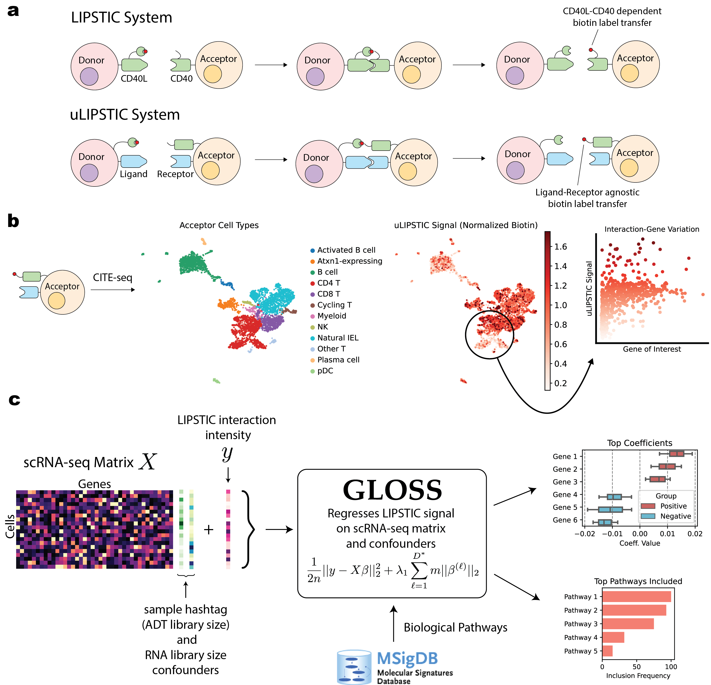

# Gloss

Gloss is a computational method that regresses LIPSTIC data on scRNA-seq features in paired LIPSTIC+scRNA-seq experiments. It accomplishes this by using an overlapping group lasso procedure using a set of pathways (which are preloaded into Gloss).



## Installation

To install Gloss, simply run `pip install .` in this cloned repository in your environment.

## Running Gloss

Gloss assumes your data is annotated already, which you can specify under the `resolutions` field of the regression.
An example script of tuning Gloss using the Hallmark pathways on your data is shown below:

```{python}
datapath = 'myscrna_anndata.h5ad' # with raw values in anndata.X

resolutions = {
    'annotations' : ['Cell Type A', 'Cell Type B']
    'annotations_fine' : ['Refined Cell Type A.1']
}

from Gloss.regresscv import RegressCV

regcv = RegressCV(datapath,
                  resolutions,
                  'hallmark',
                  'raw sample hashtag library size',
                  'RNA library size',
                  'uLIPSTIC raw signal')
```

Then, with the tuned parameters, you can run bootstrapped regression with Gloss to get robust estimates of the interaction-associated coefficients and pathways.
To do this, here is an example script:

```{python}
from Gloss.regressbootstrap import RegressBootstrap

regb = RegressBootstrap(datapath,
                        resolutions,
                        'hallmark',
                        myregcv.best_params,
                        100,
                        'raw sample hashtag library size',
                        'RNA library size',
                        'uLIPSTIC raw signal')

savepath = 'some bootstrap savepath'

import pickle
with open(savepath, 'wb') as handle:
    pickle.dump(regb, handle, protocol=4)
```

Both of the above functions internally call the `PrepData` to preprocess the data and `Regressor` functions from Gloss to run the actual regression itself.

## Normalization of LIPSTIC Signal using Gloss

Gloss can also be used to separately normalize LIPSTIC signal, by regressing out the RNA library size and sample hashtag library size confounders at a dataset level. This is done by using Gloss to regress LIPSTIC signal only on the confounders, with no genes - this reduces to Lasso regression. 

When `PrepData` is called, this is run by default, and the resulting normalized LIPSTIC expression is stored under the `gloss_normalized_biotin` observation field of the AnnData:

```{python}
datapath = 'myscrna_anndata.h5ad' # with raw values in anndata.X

from Gloss.prepdata import PrepData

prepped_data = PrepData(datapath,
                  'hallmark',
                  'raw sample hashtag library size',
                  'RNA library size',
                  'uLIPSTIC raw signal')

prepped_data.adata.obs['gloss_normalized_biotin'] # normalized biotin stored here
```

